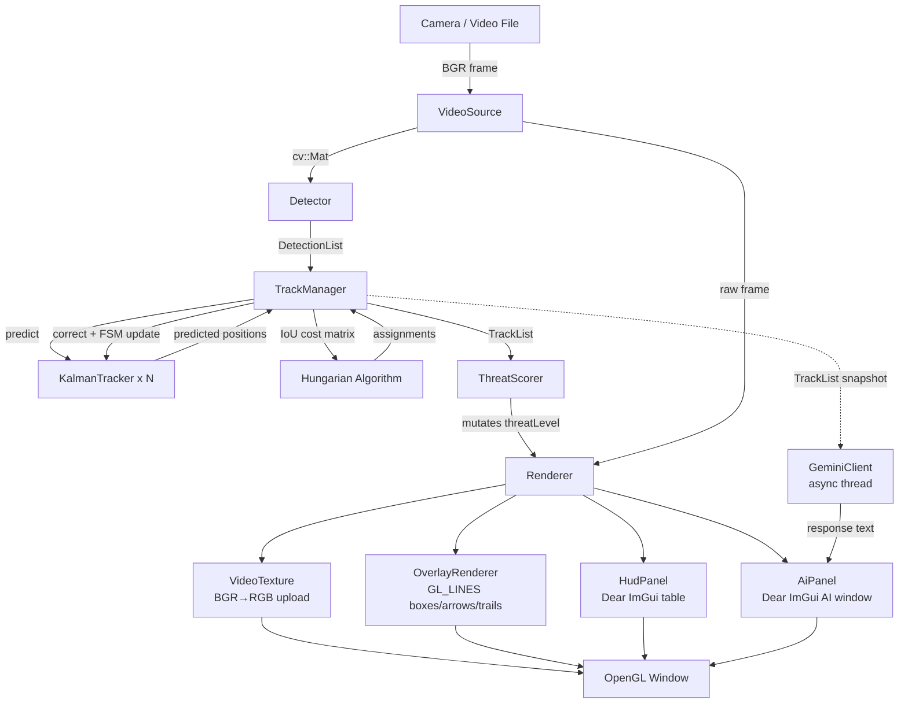
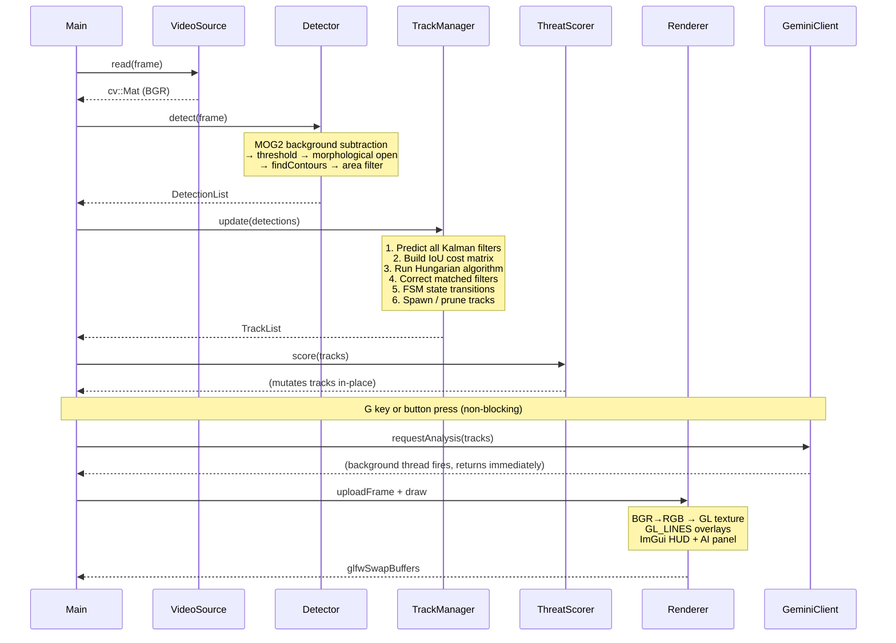
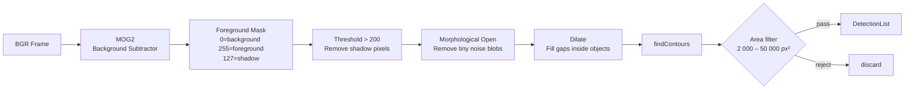
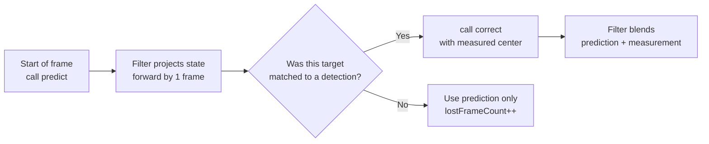
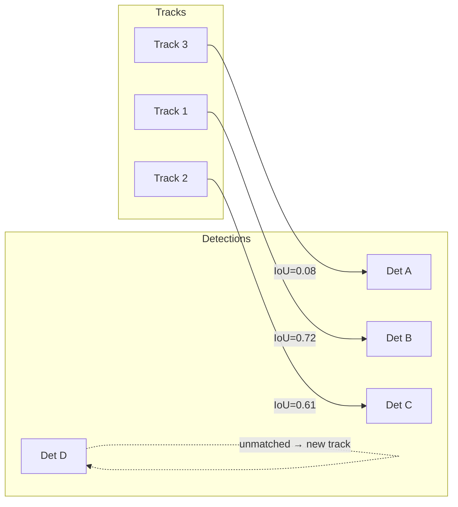
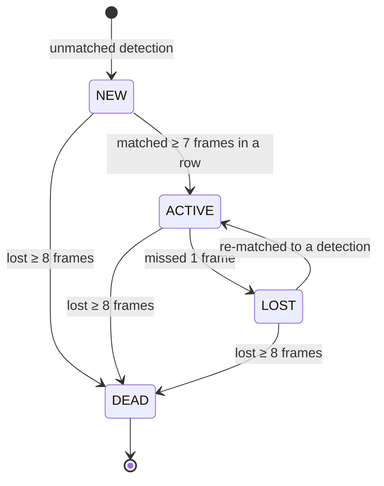
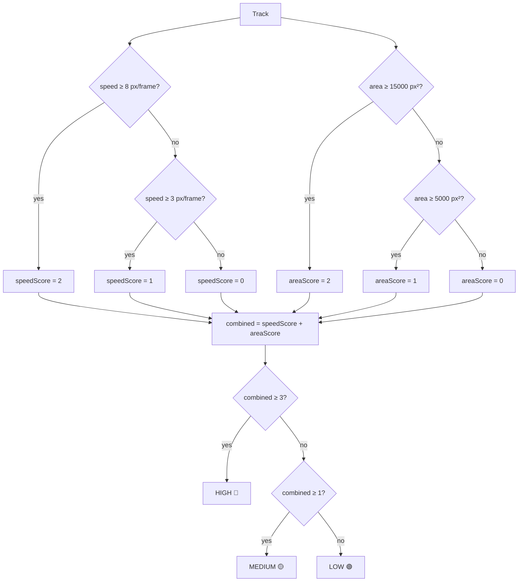
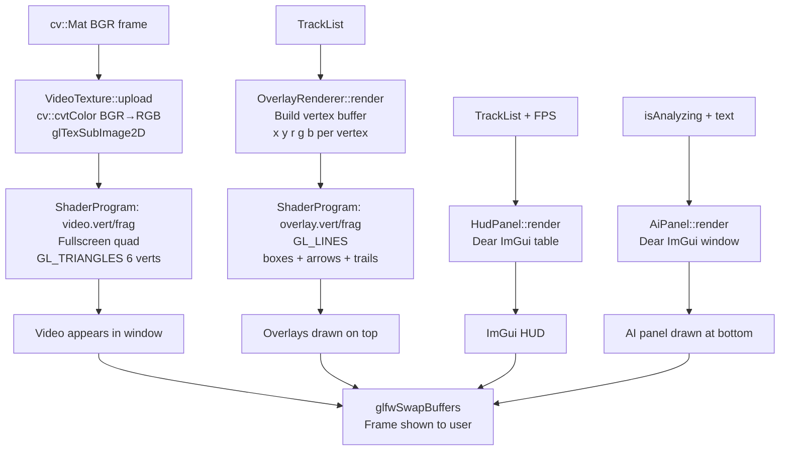

# Real-Time Multi-Target Detection & Tracking System

A C++ computer vision pipeline that detects and tracks multiple moving objects in real time — from a webcam or video file — and renders them in an OpenGL window with color-coded threat overlays, a live HUD, and an **AI Tactical Analyst** powered by the Gemini API.

Built as a defense industry portfolio piece, demonstrating: sensor pipelines, Kalman filtering, data association, real-time rendering, async networking, and LLM integration — all without a neural network detector.

---

## Quick Start

### 1. Set up your API key

```
# Copy the example and fill in your key
copy .env.example .env
```

Edit `.env`:
```
GOOGLE_API_KEY = your_key_here
```

### 2. Build and run

```powershell
# Install all dependencies (one-time, takes a few minutes)
vcpkg install --triplet x64-windows

# Configure
cmake -B build -S . `
  -DCMAKE_TOOLCHAIN_FILE="C:/vcpkg/scripts/buildsystems/vcpkg.cmake" `
  -DVCPKG_TARGET_TRIPLET=x64-windows

# Compile
cmake --build build --config Release

# Run
.\build\Release\CVTrackingSystem.exe assets\sample_video.mp4
```

### Controls

| Key | Action |
|-----|--------|
| `ESC` | Quit |
| `Space` | Pause / Resume |
| `R` | Reset tracker (clear all tracks) |
| `G` | Request AI tactical analysis |

---

## What You See on Screen

```
┌─────────────────────────────────────────────────────────┐
│  ┌────────────────────────────┐                          │
│  │ FPS: 47.2  Targets: 3      │  ← ImGui HUD panel       │
│  ├────┬───────┬───────┬───────┤                          │
│  │ ID │ Speed │Threat │Frames │                          │
│  │  1 │ 5.2   │  MED  │  34   │                          │
│  │  2 │ 11.0  │  HIGH │  91   │                          │
│  │  3 │ 1.1   │  LOW  │  12   │                          │
│  └────┴───────┴───────┴───────┘                          │
│                                                          │
│         ┌──────────┐  ← red box = HIGH threat            │
│         │  TARGET  │───►  cyan arrow = velocity          │
│         └──────────┘                                     │
│        ·····  ← fading trail (last 30 positions)         │
│                                                          │
│  ┌──────────────────────────────────────────────────┐    │
│  │ [ AI TACTICAL ANALYST ]          calls: 2 / 20   │    │
│  │──────────────────────────────────────────────────│    │
│  │ 2 active targets. Track #2 (HIGH, moving         │    │
│  │ down-right at 11 px/frame) is the primary        │    │
│  │ concern. Track #1 appears to be slow background  │    │
│  │ activity — monitor but low priority.             │    │
│  │──────────────────────────────────────────────────│    │
│  │            [ Analyze Now ]                       │    │
│  └──────────────────────────────────────────────────┘    │
└─────────────────────────────────────────────────────────┘
```

**Box colors** reflect threat level:

| Color | Threat | Condition |
|-------|--------|-----------|
| Green | LOW | Slow and small |
| Yellow | MEDIUM | Moderate speed or size |
| Red | HIGH | Fast and/or large |

---

## Architecture Overview



---

## Per-Frame Data Flow



---

## Module Deep-Dives

### 1. VideoSource (`capture/`)

A thin RAII wrapper around `cv::VideoCapture`. **RAII** (Resource Acquisition Is Initialization) means the camera is opened in the constructor and automatically closed when the object is destroyed — no manual cleanup needed.

```
VideoSource created
    └── constructor opens camera/file
    └── stores width, height, fps

VideoSource destroyed
    └── cv::VideoCapture destructor closes device automatically
```

Key C++ concept used: **deleted copy, defaulted move**

```cpp
VideoSource(const VideoSource&)        = delete;   // can't copy a camera handle
VideoSource& operator=(const VideoSource&) = delete;
VideoSource(VideoSource&&)             = default;  // CAN transfer ownership
VideoSource& operator=(VideoSource&&)  = default;  // used in the loop-reset
```

---

### 2. Detector (`detection/`)

Separates moving foreground from static background using **MOG2** (Mixture of Gaussians v2), a statistical background model built into OpenCV.



**What is morphological opening?**
It's an erosion followed by a dilation. Erosion shrinks blobs, removing tiny specks. Dilation grows them back. The net effect: small noise disappears, larger real objects survive.

**Sensitivity tuning** (in `Detector.hpp` / `Detector.cpp`):

| Parameter | Default | Effect |
|-----------|---------|--------|
| `varThreshold` (MOG2) | 36 | How much a pixel must change to be called foreground. Higher = less sensitive to noise/flicker. |
| `MIN_AREA` | 2000 px² | Minimum blob size. Raise to ignore small noise, lower to catch small targets. |
| `MAX_AREA` | 50 000 px² | Maximum blob size. Lower to ignore large background regions. |

Each surviving contour becomes a `Detection` struct:

```cpp
struct Detection {
    cv::Rect    boundingBox;   // rectangle around the blob
    cv::Point2f center;        // (x, y) center of that rectangle
    float       area;          // pixel area of the contour
};
```

---

### 3. KalmanTracker (`tracking/`)

One `KalmanTracker` lives inside `TrackManager` for each tracked target. It estimates where a target is *even when the detector misses it* for a few frames.

#### The State Vector

The filter tracks four numbers per target:

```
state = [ x,  y,  vx,  vy ]
          ↑   ↑    ↑    ↑
        pos  pos  vel  vel
         x    y    x    y
```

#### Constant-Velocity Model

The filter assumes targets move in a straight line between frames (constant velocity). The **transition matrix** encodes this:

```
next_state = F × current_state

[ x' ]   [ 1  0  1  0 ] [ x  ]
[ y' ] = [ 0  1  0  1 ] [ y  ]
[ vx']   [ 0  0  1  0 ] [ vx ]
[ vy']   [ 0  0  0  1 ] [ vy ]

  x' = x + vx   ← position advances by velocity
  y' = y + vy
  vx'= vx        ← velocity assumed constant
  vy'= vy
```

#### Predict → Correct Cycle



When an object is briefly occluded, the filter keeps predicting its position based on its last known velocity. The track stays alive for up to `MAX_LOST` missed frames.

---

### 4. TrackManager (`tracking/`)

This is the brain of the system. It decides which detection belongs to which track each frame.

#### The Assignment Problem

Imagine 3 tracks and 4 detections. You need to find the best 1-to-1 pairing. This is called the **assignment problem**.



**IoU (Intersection over Union)** measures how much two rectangles overlap:

```
        area of overlap
IoU = ─────────────────────
       area of their union

IoU = 0.0  → no overlap at all
IoU = 1.0  → perfect overlap
```

We build an **N×M cost matrix** where `cost[i][j] = 1 - IoU(track_i, detection_j)`, then find the minimum-cost assignment using the **Hungarian algorithm** (O(n³)).

#### Track FSM (Finite State Machine)

Every track lives in one of four states:



**Why the NEW state?** A spurious detection (a shadow, a reflection, compression artifact) shouldn't immediately become a track. It must survive 7 consecutive frames before being promoted to ACTIVE and shown in the HUD.

**Sensitivity tuning** (in `TrackManager.hpp`):

| Parameter | Default | Effect |
|-----------|---------|--------|
| `CONFIRM_HITS` | 7 | Frames before NEW → ACTIVE. Higher = fewer ghost tracks. |
| `MAX_LOST` | 8 | Frames before LOST → DEAD. Lower = tracks die faster. |
| `IOU_THRESHOLD` | 0.25 | Minimum overlap to accept a match. Higher = stricter. |

---

### 5. ThreatScorer (`threat/`)

Simple rule-based classifier. Stateless (no member variables), so it's trivially thread-safe.



---

### 6. Renderer (`render/`)

The rendering layer owns the GLFW window and drives four sub-systems each frame.

#### OpenGL Rendering Pipeline



#### Why BGR→RGB?

OpenCV stores images in **BGR** order — a historical quirk. OpenGL expects **RGB**. Without the conversion, red and blue channels swap.

```cpp
cv::cvtColor(bgrFrame, m_rgbBuf, cv::COLOR_BGR2RGB);  // mandatory!
```

#### Coordinate Systems

```
Pixel space          NDC space
(0,0)──────────►    (-1,+1)──────►(+1,+1)
  │  (320,240)         │    (0,0)
  │                    │
  ▼(640,480)        (-1,-1)──────►(+1,-1)

ndcX = pixel_x / width  * 2 - 1
ndcY = 1 - pixel_y / height * 2   ← Y is flipped!
```

---

### 7. AI Tactical Analyst (`ai/`)

An async Gemini API integration that generates natural language situation reports from live tracking data. Triggered by pressing `G` or clicking "Analyze Now" in the on-screen panel.

#### What the LLM Sees

Each API call sends a prompt like:

```
You are a tactical AI analyst. Analyze the following tracking data and
give a concise 2-3 sentence situational assessment.

Current tracking report:
- Target #2 [ACTIVE]: pos=(312,180), size=8400 px^2, speed=9.3 px/frame,
  moving down-right, threat=HIGH, tracked 47 frames
- Target #5 [ACTIVE]: pos=(120,400), size=3200 px^2, speed=1.2 px/frame,
  stationary, threat=LOW, tracked 12 frames
```

Fields sent per track: **ID, state, position, bounding box size, speed, heading (8 cardinal directions), threat level, age**.

#### Cost Controls

To avoid unexpected API charges, three hard limits are enforced in `GeminiClient`:

| Guard | Default | Configurable via |
|-------|---------|-----------------|
| Cooldown | 30 s between calls | `GeminiClient` constructor arg |
| Session cap | 20 calls per run | `GeminiClient` constructor arg |
| `maxOutputTokens` | 120 tokens | `GeminiClient` constructor arg |

The panel header always shows `calls: X / 20` so usage is visible at a glance. If a limit blocks a request, the reason appears inline in the panel.

#### Thread Model

The API call never touches the render thread:

```
Render thread                    Worker thread
─────────────                    ─────────────
requestAnalysis(tracks)
  → serialize to string prompt
  → spawn std::thread ──────────► workerFunc(prompt)
  → return immediately              curl POST → Gemini
                                    parse JSON response
                                    lock mutex
                                    store result
                                    m_isAnalyzing = false

[next frames: poll each frame]
pollResult(out) ◄──────────────── (result waiting in mutex-guarded string)
  → aiText = response
  → display in AiPanel
```

---

## File Map

```
cv-project/
│
├── CMakeLists.txt              Build system — links OpenCV, GLFW, GLAD, GLM, ImGui, curl, nlohmann-json
├── vcpkg.json                  Dependency manifest
├── .env                        API keys (not committed)
├── .env.example                Template — copy to .env and fill in
│
├── shaders/
│   ├── video.vert / .frag      Fullscreen textured quad
│   └── overlay.vert / .frag    Per-vertex color lines (boxes, arrows, trails)
│
├── assets/
│   └── (drop your .mp4 here)
│
└── src/
    ├── main.cpp                Main loop: read → detect → track → score → render → AI poll
    │
    ├── common/
    │   ├── Types.hpp           Detection, Track, ThreatLevel, TrackState
    │   ├── Hungarian.hpp       Header-only O(n³) assignment algorithm
    │   └── EnvLoader.hpp       Header-only .env file parser
    │
    ├── capture/
    │   └── VideoCapture        RAII camera/file wrapper
    │
    ├── detection/
    │   └── Detector            MOG2 + morphology + contour filter
    │
    ├── tracking/
    │   ├── KalmanTracker       [x, y, vx, vy] constant-velocity Kalman filter
    │   └── TrackManager        IoU matrix → Hungarian → FSM lifecycle
    │
    ├── threat/
    │   └── ThreatScorer        Speed + area → LOW / MEDIUM / HIGH
    │
    ├── ai/
    │   └── GeminiClient        Async Gemini REST API client (libcurl + nlohmann-json)
    │
    └── render/
        ├── Renderer            Top-level: owns GLFW window, drives loop
        ├── ShaderProgram       Compile + link GLSL shaders, RAII handle
        ├── VideoTexture        BGR→RGB, glTexSubImage2D upload
        ├── OverlayRenderer     GL_LINES scratch-buffer renderer
        ├── HudPanel            Dear ImGui target table
        └── AiPanel             Dear ImGui AI analyst panel
```

---

## Build from Scratch

### Prerequisites

| Tool | Purpose |
|------|---------|
| Visual Studio 2022 | C++ compiler (MSVC) |
| CMake ≥ 3.21 | Build system |
| vcpkg | C++ package manager |

### Steps

```powershell
# 1. Install all dependencies (one-time, takes a few minutes)
cd C:\Users\pc\Desktop\cv-project
vcpkg install --triplet x64-windows

# 2. Configure the build
cmake -B build -S . `
  -DCMAKE_TOOLCHAIN_FILE="C:/vcpkg/scripts/buildsystems/vcpkg.cmake" `
  -DVCPKG_TARGET_TRIPLET=x64-windows

# 3. Compile
cmake --build build --config Release

# 4. Run
.\build\Release\CVTrackingSystem.exe assets\vid.mp4
```

CMake automatically copies shader files, `.env`, and all required DLLs next to the `.exe` after each build.

---

## C++ Concepts Demonstrated

| Concept | Where |
|---------|-------|
| RAII (constructor acquires, destructor releases) | `VideoSource`, `ShaderProgram`, `VideoTexture`, `GeminiClient` |
| Deleted copy / defaulted move | `VideoSource`, `Renderer` |
| `cv::Ptr<>` (OpenCV's smart pointer) | `Detector` — `BackgroundSubtractorMOG2` |
| `std::unique_ptr` for polymorphism | `TrackManager` — one `KalmanTracker*` per track |
| `enum class` (scoped, type-safe enum) | `ThreatLevel`, `TrackState` |
| `std::deque` (double-ended queue) | `Track::trail` — efficient front pop |
| Header-only template algorithm | `Hungarian.hpp` |
| `const` correctness | `ThreatScorer::score(const Track&)` |
| Scratch buffer pattern | `OverlayRenderer::m_vertices` — pre-allocated, cleared each frame |
| `std::thread` + `std::mutex` | `GeminiClient` — background API call without blocking render |
| `std::atomic<bool>` | `GeminiClient::m_isAnalyzing` — lock-free status flag |
| Move semantics in hot path | `pollResult()` — `std::move` avoids string copy |

---

## Performance Notes

- The overlay vertex buffer is rebuilt from scratch each frame but never `new`/`delete`-allocated — `std::vector::clear()` keeps capacity, so no heap allocation in the hot path.
- `glTexSubImage2D` re-uses GPU texture storage allocated once in `init()` — no per-frame GPU alloc.
- `glfwSwapInterval(0)` disables vsync so the loop runs as fast as the hardware allows. ~40–90 FPS at 640×480 on a typical laptop.
- The Hungarian algorithm is O(n³) in track count — fine for dozens of targets, would need approximate methods (e.g. auction algorithm) for hundreds.
- The Gemini API call runs on a dedicated thread — zero render-loop cost while waiting for a response.

---

## Recommended Demo Footage

The system requires a **static camera** (MOG2 treats camera motion as foreground).

| Source | What to search | Why it works well |
|--------|---------------|-------------------|
| **PETS 2009 dataset** | "PETS 2009 S2L1" | Classic CV benchmark — pedestrians, fixed CCTV angle |
| **UA-DETRAC dataset** | "UA-DETRAC" | Overhead highway cameras, multiple vehicles, varied speeds |
| **Pexels (free stock)** | "busy intersection top view" | Clean overhead shot, immediate multi-target tracking |

---

## Extending the Project

| Idea | Concepts learned |
|------|-----------------|
| Replace MOG2 with a YOLO model (`cv::dnn`) | Neural network inference in OpenCV |
| Add a config file (JSON/TOML) for thresholds | File I/O, serialization |
| Record output video with `cv::VideoWriter` | OpenCV encoding pipeline |
| Replace Hungarian with JPDA for probabilistic association | Probabilistic data association |
| Add a map view (bird's-eye) as a second window | Multiple GL contexts |
| Stream AI analysis to a log file | File I/O, structured logging |
